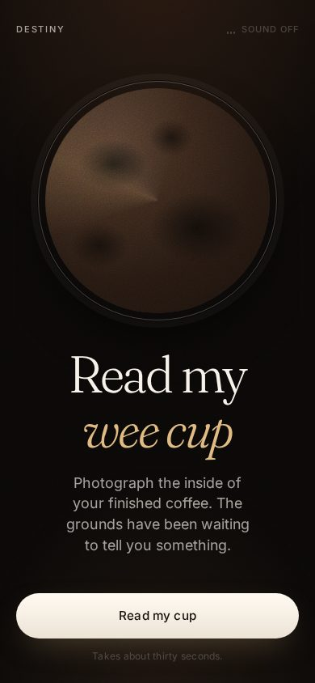
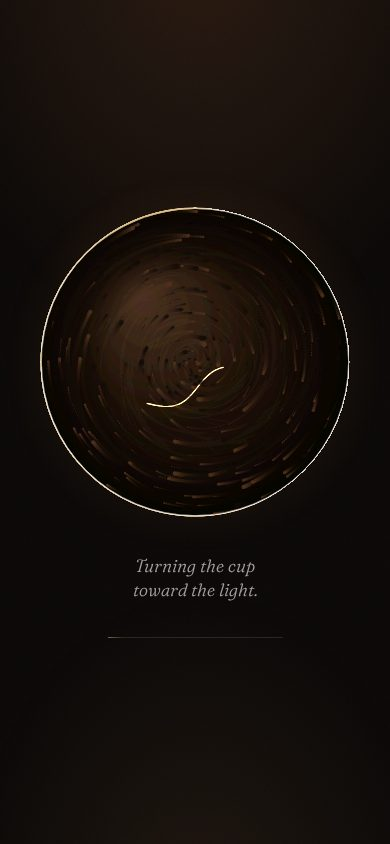
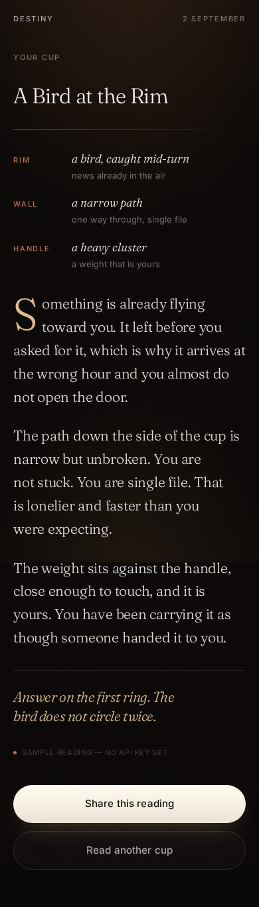
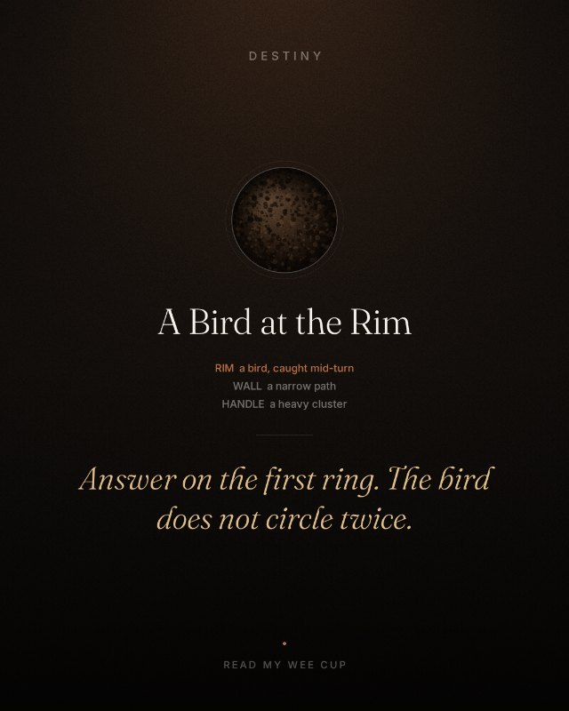
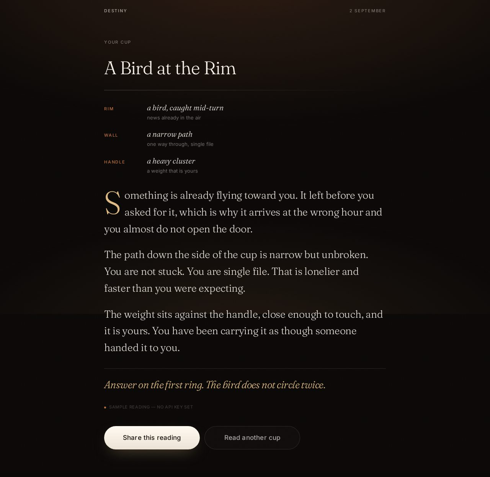

<h1>Destiny</h1>

<p><strong>Turkish coffee reading, reimagined as a web app.</strong> Photograph the inside of your
drained cup. The grounds get read, and you get a fortune written in a voice that
does not sound like a horoscope.</p>

<p>
  
  
  
</p>

---

## What it is

Tasseography is a social ritual: you finish the coffee, turn the cup onto the
saucer, wait for it to cool, and somebody who claims to know how tells you what
is in the grounds. Destiny is that, on a phone, in about thirty seconds.

Six states, one continuous flow: **land → capture → confirm → read → reveal →
share**, plus one in-voice state for when the cup cannot be read at all.

No accounts, no database, no history. You get a reading and a card to send to
someone, and that is the whole product.

## How the reading works

Two model calls, deliberately separated.

**The eye** looks at the photograph and names what is in the grounds: three to
five shapes, each placed in a region of the cup, plus the texture and the
negative space. It is instructed to interpret loosely and commit anyway, never
to hedge. Coffee grounds are abstract and low-contrast, so a model that
"detects" confidently is interpreting either way. That ambiguity is the medium,
not a bug.

**The voice** never sees the photograph. It receives the shapes as text and
writes the fortune. Keeping them apart is what keeps the voice stable: a single
call that both looks and writes drifts toward describing the image instead of
reading it.

Where a shape falls changes what it means, and both layers speak the same
dialect:

| Region | Reads as |
|---|---|
| `rim` | the near future, days to a couple of weeks |
| `wall` | the coming weeks and months |
| `base` | what is deep, old, or already carried |
| `handle` | the drinker, their home, the people already close |

The voice was locked before any screen was designed, because the shape of a
reading decides the shape of the reveal. The full spec and the ten reference
readings are in **[docs/VOICE.md](docs/VOICE.md)**.

<p>
  
</p>

## Run it locally

```bash
git clone https://github.com/mymomcallsmeeylul/readmyweecup.git
cd readmyweecup
npm run dev            # http://localhost:3000
```

No install step and no dependencies — the dev server is a single file of Node
standard library, and the app is plain HTML, CSS and ES modules.

**It works with no API key.** Without one, `/api/read` serves the reference
readings and the reveal is labelled as a sample, which is enough to work on the
design, the motion and the flow. For real readings:

```bash
cp .env.example .env   # then add your key
```

| Variable | Required | Default |
|---|---|---|
| `ANTHROPIC_API_KEY` | for real readings | — (falls back to demo mode) |
| `VISION_MODEL` | no | `claude-sonnet-5` |
| `VOICE_MODEL` | no | `claude-sonnet-5` |
| `PORT` | no | `3000` |

The key is only ever read inside `api/read.js`. The browser talks to that
endpoint and nothing else, so nothing sensitive reaches the client — which
matters, because this repo is public.

## Deploy

Zero-config on Vercel: the root is static and `api/read.js` becomes a serverless
function. Set `ANTHROPIC_API_KEY` in the project's environment variables, and
raise nothing else.

```bash
npx vercel deploy --prod
```

Any host that serves static files and runs one Node function will do; the
handler is a plain `(req, res)` function with no framework in it.

## Layout

```
index.html            the six screens, as markup
styles/tokens.css     colour, type scale, spacing, radii, motion
styles/app.css        every screen, mobile first
scripts/app.js        state machine, routing, share
scripts/grounds.js    the reading moment (canvas particle sim)
scripts/sharecard.js  the 1080x1350 share card renderer
scripts/image.js      client-side resize and recompress before upload
scripts/ambient.js    synthesised ambient sound, off by default
api/read.js           the endpoint: eye, then voice
api/_prompts.js       both prompts
api/_readings.js      the ten reference readings — few-shot, fallback, and spec
fonts/                self-hosted Fraunces and Inter (SIL OFL 1.1)
docs/VOICE.md         the voice spec
```

## Design notes

**The wait is the product.** A reading takes a minimum of 5.4 seconds even when
the answer arrives sooner. The grounds are a real canvas particle simulation:
they arrive agitated, spin in a vortex that loses energy the way liquid does,
drift out toward the wall, and settle. Shapes surface in the sediment for a
couple of seconds and sink again. It is never a progress bar, because it does
not know how long the read will take and should not pretend to.

**One cup runs through everything.** The same circle holds a slow sheen on the
landing, your photograph on confirm, the simulation during the read, and a small
drawn mark on the share card.

**Type carries it.** Fraunces for the reading, with its optical size, softness
and wonk axes doing real work at display sizes; Inter for interface text. The
fonts are self-hosted, so the first paint never waits on a third party and a
fork runs offline.

**Dark by decision, not by default.** There is no light theme. A fortune is a
night object: it wants a black room, warm light and porcelain.

**Mobile first, verified.** Every screen except the reveal is a fixed frame, so
the action stays in view and the middle scrolls if a small phone runs out of
room. Checked at 360×640 through 414×896 and out to desktop.

Photos are resized to a 1280px long edge and recompressed in the browser before
upload, so a 6MB camera JPEG leaves the phone as roughly 200KB.

<p>
  
</p>

## Licence

MIT — see [LICENSE](LICENSE). Fraunces and Inter are SIL OFL 1.1; their licences
are in `fonts/`.
