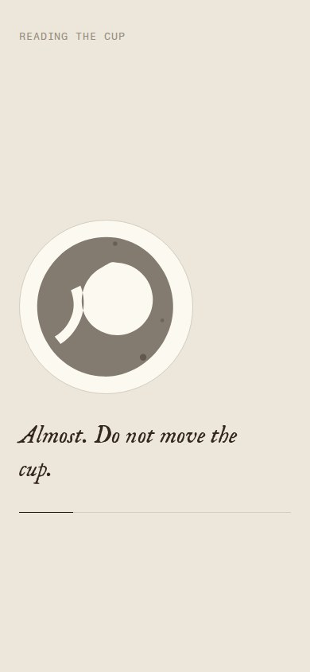
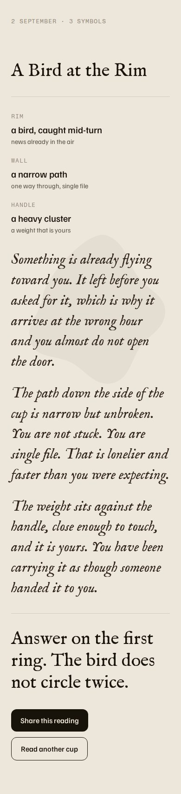
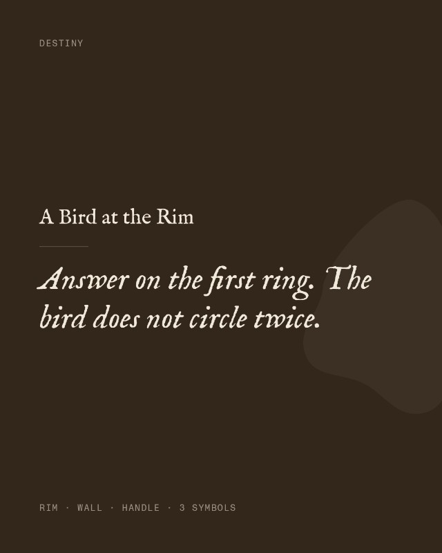
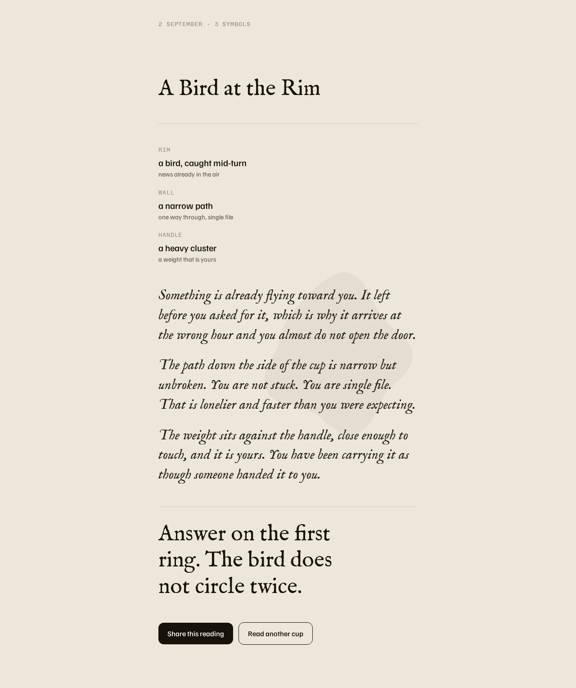

<h1>Destiny</h1>

<p><strong>Turkish coffee reading, reimagined as a web app.</strong> Photograph the inside of your
drained cup. The grounds get read, and you get a fortune written in a voice that
does not sound like a horoscope.</p>

<p>
  
  
  
</p>

---

## What it is

Tasseography is a social ritual: you finish the coffee, turn the cup onto the
saucer, wait for it to cool, and somebody who claims to know how tells you what
is in the grounds. Destiny is that, on a phone, in about thirty seconds.

One screen to start on, then **read → reveal → share**, plus one in-voice
state for when the cup cannot be read at all. The opening screen holds the
whole setup: add one to four photographs of the same cup, pick what you are
asking about, and say anything else in your own words.

No accounts, no database, no history. You get a reading and a card to send to
someone, and that is the whole product.

## How the reading works

Two model calls, deliberately separated.

**The eye** looks at the photographs and names what is in the grounds: three to
five shapes in total, each placed in a region of the cup, plus the texture and
the negative space. Several photographs are read as one cup from several
angles, never as several cups. It is instructed to interpret loosely and commit anyway, never
to hedge. Coffee grounds are abstract and low-contrast, so a model that
"detects" confidently is interpreting either way. That ambiguity is the medium,
not a bug.

**The voice** never sees the photographs. It receives the shapes as text and
writes the fortune. The topic tag steers which way it reads them, and anything
the drinker typed arrives as quoted context, never as an instruction. Keeping them apart is what keeps the voice stable: a single
call that both looks and writes drifts toward describing the image instead of
reading it.

Where a shape falls changes what it means, and both layers speak the same
dialect:

| Region | Reads as |
|---|---|
| `rim` | the near future, days to a couple of weeks |
| `wall` | the coming weeks and months |
| `base` | what is deep, old, or already carried |
| `handle` | the drinker, their home, the people already close |

The voice was locked before any screen was designed, because the shape of a
reading decides the shape of the reveal. The full spec and the ten reference
readings are in **[docs/VOICE.md](docs/VOICE.md)**.

<p>
  
</p>

## Design

The app is built to a written design system, kept in the repo as
**[docs/DESIGN-SYSTEM.md](docs/DESIGN-SYSTEM.md)**. It is the source of truth,
and the build follows it rather than improvising around it.

**Warm and quiet.** One warm neutral family from near-white to near-black plus a
single espresso brown, and no accent hue at all. Emphasis comes from weight,
size, and ink against espresso. `styles/tokens.css` is the system's `:root`
block pasted verbatim; nothing downstream hardcodes a colour.

**Type carries the personality.** IM Fell English — a digitisation of a
17th-century Oxford letterpress face — for the wordmark, the headings and every
fortune, italic for the reading itself. Familjen Grotesk for interface and body.
Fragment Mono for short meta labels only. The antique serif is the one
expressive move; everything else stays plain.

**Flat and still.** No gradients, no drop shadows, no looping or ambient motion,
no animated texture. Depth comes from the surface scale — paper, raised, sunken
— not from effects. The optional paper grain ships switched off; set
`data-grain="on"` on `<html>` to turn it on.

**The 4px grid, without exception.** Every padding, margin, gap and radius in
`styles/app.css` is a `--space-*` or `--radius-*` token, so every one of them is
divisible by four. Touch targets are at least 44px.

**One calm column, left-aligned,** held to 640px on desktop with 24 to 32px of
screen padding.

**Motion answers actions.** The one orchestrated moment is the reading: a quiet
wait over `--dur-ritual`, in-voice lines replacing one another, a single finite
hairline easing toward the edge — then the fortune unfolds block by block on
`--dur-slow`. Nothing on any screen loops or drifts, and
`prefers-reduced-motion` is honoured throughout.

> **Note on the brief.** The product brief called for the reading moment to be a
> live animation of grounds settling and swirling. The design system rules out
> looping and ambient motion and says no canvas, so the wait is still: the cup is
> a flat mark, and the movement is in the language and in the unfolding of the
> reveal. The design system won, as it says it should.

<p>
  
</p>

## Run it locally

```bash
git clone https://github.com/mymomcallsmeeylul/readmyweecup.git
cd readmyweecup
npm run dev            # http://localhost:3000
```

No install step and no dependencies — the dev server is a single file of Node
standard library, and the app is plain HTML, CSS and ES modules.

**It works with no API key.** Without one, `/api/read` serves the reference
readings and the reveal is labelled as a sample, which is enough to work on the
design, the motion and the flow. For real readings:

```bash
cp .env.example .env   # then add your key
```

| Variable | Required | Default |
|---|---|---|
| `ANTHROPIC_API_KEY` | for real readings | — (falls back to demo mode) |
| `VISION_MODEL` | no | `claude-sonnet-5` |
| `VOICE_MODEL` | no | `claude-sonnet-5` |
| `PORT` | no | `3000` |

The key is only ever read inside `api/read.js`. The browser talks to that
endpoint and nothing else, so nothing sensitive reaches the client — which
matters, because this repo is public.

## Deploy

Zero-config on Vercel: the root is static and `api/read.js` becomes a serverless
function. Set `ANTHROPIC_API_KEY` in the project's environment variables.

```bash
npx vercel deploy --prod
```

Any host that serves static files and runs one Node function will do; the
handler is a plain `(req, res)` function with no framework in it.

## Layout

```
index.html               every screen, as markup
styles/tokens.css        the design system's :root, verbatim
styles/app.css           every screen, mobile first, all on the 4px grid
scripts/app.js           state machine, routing, share
scripts/sharecard.js     the 1080x1350 share card renderer
scripts/image.js         client-side resize and recompress before upload
scripts/icons.js         the Lucide icons the interface uses, inlined
scripts/ambient.js       synthesised ambient sound, off by default
api/read.js              the endpoint: eye, then voice
api/_prompts.js          both prompts
api/_readings.js         the ten reference readings — few-shot, fallback, spec
docs/DESIGN-SYSTEM.md    the design system this build follows
docs/VOICE.md            the voice spec
```

## Notes

Photos are resized to a 1280px long edge and recompressed in the browser before
upload, so a 6MB camera JPEG leaves the phone as roughly 200KB. Four of them
still land well inside the request limit.

Icons are Lucide, copied in as raw paths rather than pulled from a package:
there is no build step, and four icons do not justify a dependency. An icon is
never the accessible name of a control; the glyph is `aria-hidden` and the name
comes from real text or an `aria-label`.

Every screen except the reveal is a fixed frame, so the action stays in view and
the middle scrolls if a small phone runs out of room. Checked at 360×640 through
414×896 and out to desktop.

The system's derived night theme ships as tokens under `[data-theme="dark"]`.
The reference is light-only, so there is no toggle in the UI; setting the
attribute switches the whole app.

## Licence

MIT — see [LICENSE](LICENSE). IM Fell English, Familjen Grotesk and Fragment
Mono are loaded from Google Fonts and are licensed under the SIL OFL 1.1.
